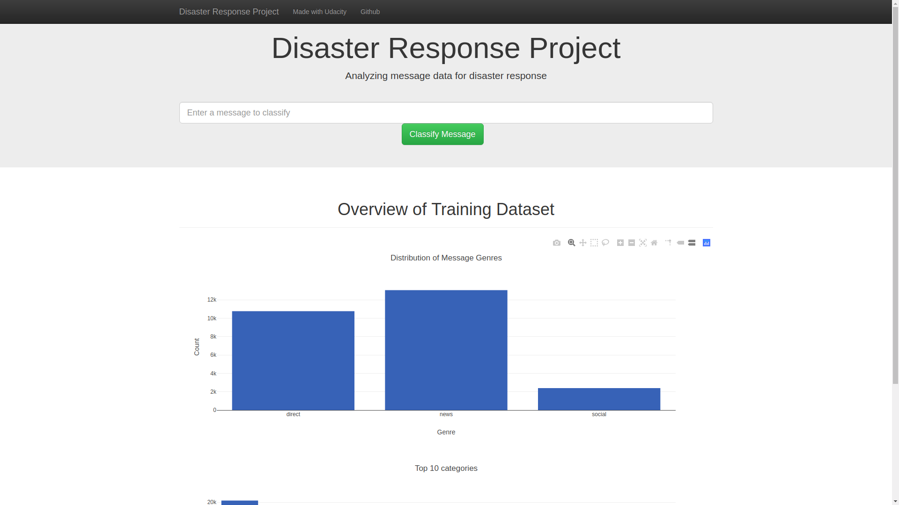
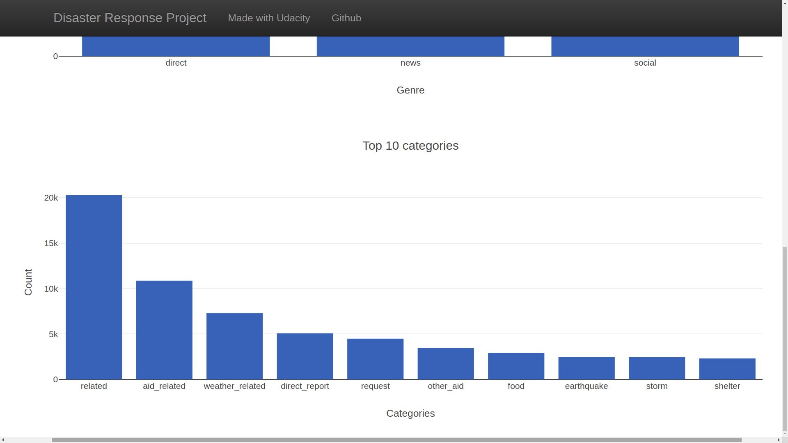
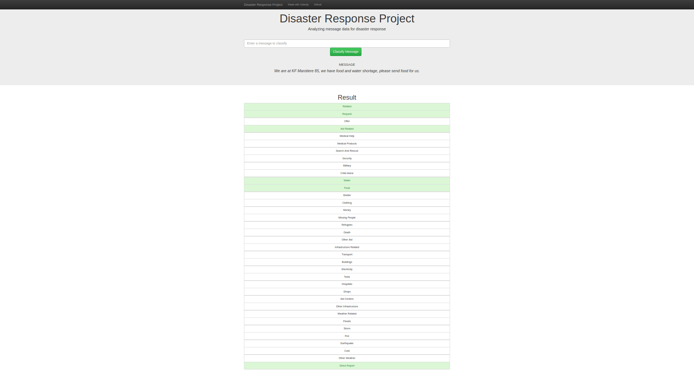

# Disaster Response Pipeline Project

## Project Motivation
 In this project, I have applied Data Engineering skills to analyze disaster data from Figure Eight to build a model for an API that classifies disaster messages. 
-  ETL pipeline has been written which includes reading csv data files , merging files to single csv and save cleaned data as sqlite database file
- ML pipeline has been written to read sqlite database file and appiies text processing then finally save model as pickle file
- Flask Web App has been developed that take user disaster message and classify message using trained model classifer.

## File Description

    .
    ├── app     
    │   ├── run.py                           # Python file to run Flask app
    │   └── templates   
    │       ├── go.html                      # Classification result page of web app
    │       └── master.html                  # Main page of web app    
    ├── data                   
    │   ├── disaster_categories.csv          # All category data  
    │   ├── disaster_messages.csv            # All messgae data
    │   └── process_data.py                  # Python script file to clean data 
    ├── models
    │   └── train_classifier.py              # Python script to train model on clean data           
    └── README.md


### Instructions:
1. Run the following commands in the project's root directory to set up your database and model.

    - To run ETL pipeline that cleans data and stores in database
        `python data/process_data.py data/disaster_messages.csv data/disaster_categories.csv data/DisasterResponse.db`
        
    - To run ML pipeline that trains classifier and saves
        `python models/train_classifier.py data/DisasterResponse.db models/classifier.pkl`

2. Go to the app's directory and run the following commands to start your web app.
    ```sh
    $ env | grep WORK
    ```
3. Copy **SPACEDOMAIN** and **SPACEID** for next step.
4. Build URL [http://{SPACEID}-3001.{SPACEDOMAIN}]
    ```sh
    $ python run.py
    ```

5. Go to the URL build in STEP 4


## Screenshot of Web App

### Message Distribution by genre


### Categories Distribution top 10



### Working Example screenshot for disaster message


